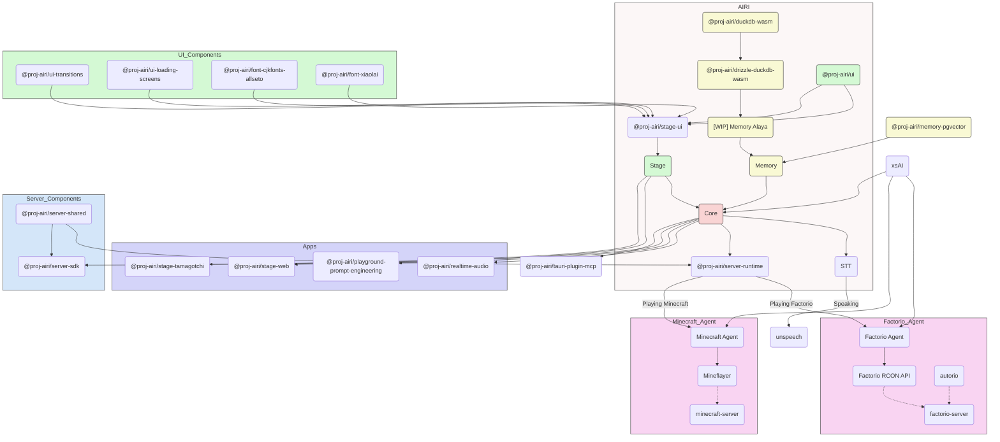

# Project Architecture

This document outlines the architecture of Project AIRI. The following diagram provides a high-level overview of the various components and how they interact.

## Architecture Diagram

## Explanation

This architecture is designed around a central AI brain, called **`AIRI`**, which can interact with the world through different applications and services.

### Core Components (The `AIRI` subgraph)

*   **`Core`**: This is the heart of the application. It orchestrates everything, connecting the user interface, memory, and other services.
*   **`Stage`**: This represents the frontend of the main application. It's built from smaller UI components (`@proj-airi/ui` and `@proj-airi/stage-ui`).
*   **`Memory`**: This is the AI's brain. From the file system, I can see it uses `DuckDB` (a database that can run in the browser) to store information. The diagram shows a `[WIP] Memory Alaya`, which is likely a more advanced memory system under development.
*   **`STT` (Speech-to-Text)**: This component handles voice recognition, converting spoken audio into text for the AI to understand.
*   **`SVRT` (Server Runtime)**: This is the backend logic that connects to external services, like game agents.

### Applications (The `Apps` subgraph)

These are the main ways you interact with AIRI:

*   **`@proj-airi/stage-web`**: This is the web application that runs in your browser. Its source code can be found in `apps/stage-web`.
*   **`@proj-airi/stage-tamagotchi`**: This is the desktop application. It is a [Tauri](https://tauri.app/) application, which means it uses web technologies (like Vue.js) for its interface but can interact more deeply with the operating system, powered by a Rust backend. Its code is in `apps/stage-tamagotchi`.
*   **Other Apps**: The diagram also shows `realtime-audio` and `playground-prompt-engineering`, which are likely smaller, focused applications for development and demonstration purposes.

### Game Agents

A key feature of this project is its ability to play games. The diagram shows two agents:

*   **`Factorio Agent`**: This module allows the AI to play Factorio. It uses a `Factorio RCON API` to communicate with a Factorio server.
*   **`Minecraft Agent`**: This module allows the AI to play Minecraft, using the `Mineflayer` library to control a character in a Minecraft server.

### Key Libraries & Services

*   **`xsAI`**: This is a crucial library that provides an interface to connect the `Core` brain to many different Large Language Models (LLMs) like ChatGPT, Claude, and others.
*   **`@proj-airi/tauri-plugin-mcp`**: This is one of the Rust-based Tauri plugins found in the `crates/` directory. It's used by the `StageTamagotchi` desktop app to enhance its capabilities.
